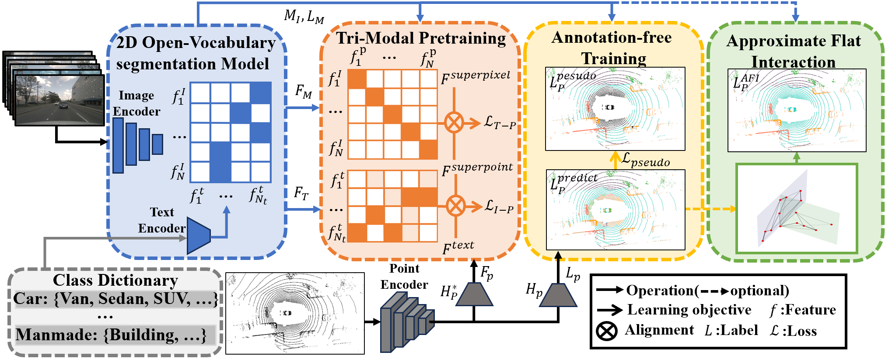

# 3D Self-Supervision by Distilling 2D Open-Vocabulary Segmentation Models for Annotation-free Training

## Overview of the method:



SSOV consists of two stages: Tri-Modal Pre-training (TMP) and Annotation-free training (SSOV-baseline). Both stages leverage masks $M_\mathcal{I}$ and mask labels $L_M$ extracted from 2D open-vocabulary segmentation models, while mask features $F_M$ and text features $F_T$ are employed only in TMP. TMP enhances scene understanding through contrastive losses (superpixel-superpoint contrastive loss and text-superpoint contrastive loss), while our baseline employs pseudo-labels to supervise the 3D network. Additionally, to bridge dataset classes and open vocabularies, we introduce a class dictionary $\mathcal{C}$. The Approximate Flat Interaction (AFI) optimizes the results of annotation-free training by spatial structural analysis in a broad perception domain.

## Annotation-free segementation demo:
<p align="center">
  
</p>

## Installation
Please follow [installation](INSTALL.md). 

## Data Preparation
Please follow [dataset preperation](DATASETS.md)

## Sueprpixel-superpoint generation

You can choose from the following three open-vocabulary segmentation models:

For CAT-Seg:
Please prepare the checkpoint and other related content according to [CAT-Seg](https://github.com/KU-CVLAB/CAT-Seg/tree/main).
```
# superpixels generation
cd ov_segment/CAT-Seg
python demo/superpixel_generation.py
# superpoints generation
python superpixel2superpoint.py
```

For FC-CLIP:
Please prepare the checkpoint and other related content according to [FC-CLIP](https://github.com/bytedance/fc-clip/tree/main).
```
# superpixels generation
cd ov_segment/fc-clip
python superpixel_generation.py
# superpoints generation
python superpixel2superpoint.py
```

For SAN:
Please prepare the checkpoint and other related content according to [SAN](https://github.com/MendelXu/SAN/tree/main).
```
# superpixels generation
cd ov_segment/SAN
python superpixel_generation.py
# superpoints generation
python superpixel2superpoint.py
```

## Training
### Prertrain:
For example:
```
# pretrain
python pretrain.py --cfg_file "config/pretrain_san.yaml"
```

### Annotation-free training

For example:
```
# annotation-free
python annotation_free.py --cfg_file "config/annotation_free_san.yaml" --pretraining_path "SSOV_pretrain_san.pt"
```
We use --pretraining_path ["minkunet_slidr.pt"](https://github.com/valeoai/SLidR) as baseline.

Or, you can change ```$training : 'parametrize'``` in config/annotation_free_XXX.yaml for pretraining.


### Finetuning
For example:
```
# finetune (SSOV-TMP)
python downstream.py --cfg_file "config/semseg_nuscenes.yaml" --pretraining_path "SSOV_pretrain_san.pt"
# or (SSOV)
python downstream.py --cfg_file "config/semseg_nuscenes.yaml" --pretraining_path "SSOV_pretrain_with_af_san.pt"
# SemanticKITTI
python downstream.py --cfg_file "config/semseg_kitti.yaml" --pretraining_path "SSOV_pretrain_with_af_san.pt"
```

Or, you can change:
```
dataset_skip_step : 1
freeze_layers : True
lr : 0.05
lr_head : Null
```
in config/semseg_nuscenes.yaml for linear probing.

### Evaluation
For example:
```
# evaluate
python evaluate.py --cfg_file "config/annotation_free_san.yaml" --resume_path "SSOV_af_with_pretrain_san.pt" --dataset nuScenes
```
AFI requires no training and can be used directly during inference.
```
python evaluate.py --cfg_file "config/annotation_free_san.yaml" --resume_path "SSOV_af_with_pretrain_san.pt" --dataset nuScenes --save True
cd afi
python afi.py --cfg_file "../config/annotation_free_san.yaml"
```
We will directly incorporate AFI into the inference pipeline in the future.


## Results
We will release checkpoints here after publication.
#### Results of annotation-free semantic segementation (% mIoU):
Method      |nuScenes<br />annotation-free|checkpoint
---         |:-:                          |:-:
SSOV+CAT-Seg|42.83                        |checkpoint
SSOV+FC-CLIP|43.28                        |checkpoint
SSOV+SAN    |**47.73**                    |checkpoint

#### Finetuning for semantic segementation (% mIoU):
Method          |nuScenes<br />lin. probing|nuScenes<br />Finetuning with 1% data|KITTI<br />Finetuning with 1% data|pretrain checkpoint
---             |:-:                       |:-:                                  |:-:                               |:-:
Random init.    |8.1                       |30.3                                 |39.5                              |-
SSOV-TMP+CAT-Seg|43.95                     |46.61                                |**48.14**                         |checkpoint
SSOV-TMP+FC-CLIP|44.24                     |45.73                                |47.02                             |checkpoint
SSOV-TMP+SAN    |46.29                     |47.60                                |47.72                             |checkpoint
SSOV+CAT-Seg    |51.02                     |49.14                                |47.59                             |checkpoint
SSOV+FC-CLIP    |52.92                     |50.58                                |45.86                             |checkpoint
SSOV+TMP+SAN    |**56.35**                 |**51.75**                            |46.60                             |checkpoint


### We will continue to improve.


